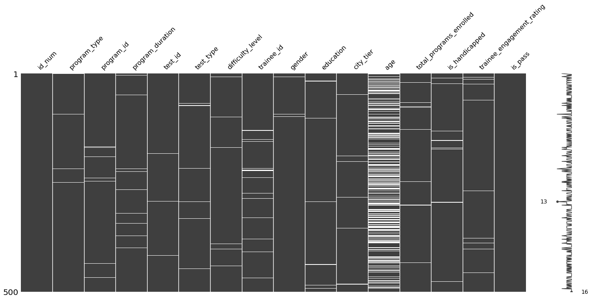
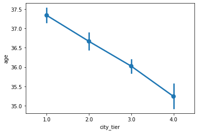
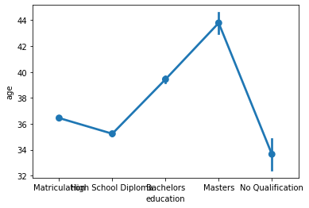
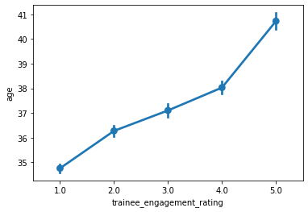
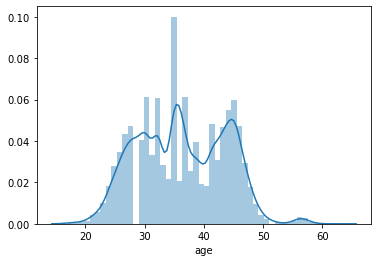
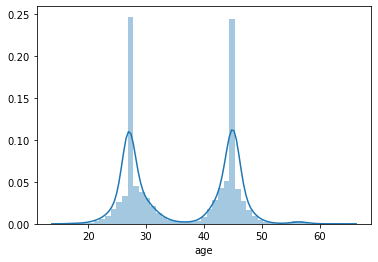

# QG 中期考核

## 相关设置


```python
import numpy as np
import pandas as pd
import matplotlib.pyplot as plt
import seaborn as sns
import missingno as msno
%matplotlib inline

# sklearn
from sklearn.impute import KNNImputer
from sklearn.model_selection import train_test_split
from sklearn.linear_model import LogisticRegression
from sklearn.model_selection import cross_val_score
from sklearn.neighbors import KNeighborsClassifier
from sklearn.naive_bayes import GaussianNB
from sklearn.ensemble import GradientBoostingClassifier
from sklearn.linear_model import SGDClassifier
from sklearn.tree import DecisionTreeClassifier
from sklearn.neighbors import KNeighborsClassifier
from sklearn.linear_model import LinearRegression
from sklearn.metrics import accuracy_score

from IPython.core.interactiveshell import InteractiveShell
InteractiveShell.ast_node_interactivity = "all"  # 一个cell显示多输出

pd.set_option('display.max_rows', 100)  # 设置最大显示100行
pd.set_option('display.max_columns', 100)  # 设置最大显示100列

import warnings
warnings.filterwarnings("ignore")
```

## 查看数据


```python
train_df = pd.read_csv('./data//train/train.csv')
test_df = pd.read_csv('./data/test/test2.csv')
```


```python
train_df.head()
```


<div>
<style scoped>
    .dataframe tbody tr th:only-of-type {
        vertical-align: middle;
    }

    .dataframe tbody tr th {
        vertical-align: top;
    }

    .dataframe thead th {
        text-align: right;
    }
</style>
<table border="1" class="dataframe">
  <thead>
    <tr style="text-align: right;">
      <th></th>
      <th>id_num</th>
      <th>program_type</th>
      <th>program_id</th>
      <th>program_duration</th>
      <th>test_id</th>
      <th>test_type</th>
      <th>difficulty_level</th>
      <th>trainee_id</th>
      <th>gender</th>
      <th>education</th>
      <th>city_tier</th>
      <th>age</th>
      <th>total_programs_enrolled</th>
      <th>is_handicapped</th>
      <th>trainee_engagement_rating</th>
      <th>is_pass</th>
    </tr>
  </thead>
  <tbody>
    <tr>
      <th>0</th>
      <td>9389_150</td>
      <td>Y</td>
      <td>Y_1</td>
      <td>136.0</td>
      <td>150.0</td>
      <td>offline</td>
      <td>intermediate</td>
      <td>9389.0</td>
      <td>M</td>
      <td>Matriculation</td>
      <td>3.0</td>
      <td>24.0</td>
      <td>5.0</td>
      <td>N</td>
      <td>1.0</td>
      <td>0</td>
    </tr>
    <tr>
      <th>1</th>
      <td>16523_44</td>
      <td>T</td>
      <td>T_1</td>
      <td>131.0</td>
      <td>44.0</td>
      <td>offline</td>
      <td>easy</td>
      <td>16523.0</td>
      <td>F</td>
      <td>High School Diploma</td>
      <td>4.0</td>
      <td>26.0</td>
      <td>2.0</td>
      <td>N</td>
      <td>3.0</td>
      <td>1</td>
    </tr>
    <tr>
      <th>2</th>
      <td>13987_178</td>
      <td>Z</td>
      <td>Z_2</td>
      <td>120.0</td>
      <td>178.0</td>
      <td>online</td>
      <td>easy</td>
      <td>13987.0</td>
      <td>M</td>
      <td>Matriculation</td>
      <td>1.0</td>
      <td>40.0</td>
      <td>1.0</td>
      <td>N</td>
      <td>2.0</td>
      <td>1</td>
    </tr>
    <tr>
      <th>3</th>
      <td>13158_32</td>
      <td>T</td>
      <td>T_2</td>
      <td>117.0</td>
      <td>32.0</td>
      <td>offline</td>
      <td>easy</td>
      <td>13158.0</td>
      <td>F</td>
      <td>Matriculation</td>
      <td>3.0</td>
      <td>NaN</td>
      <td>4.0</td>
      <td>N</td>
      <td>1.0</td>
      <td>1</td>
    </tr>
    <tr>
      <th>4</th>
      <td>10591_84</td>
      <td>V</td>
      <td>V_3</td>
      <td>131.0</td>
      <td>84.0</td>
      <td>offline</td>
      <td>intermediate</td>
      <td>10591.0</td>
      <td>F</td>
      <td>High School Diploma</td>
      <td>1.0</td>
      <td>42.0</td>
      <td>2.0</td>
      <td>N</td>
      <td>4.0</td>
      <td>1</td>
    </tr>
  </tbody>
</table>
</div>


```python
msno.matrix(train_df.sample(500))#可视化缺失值
```


    <matplotlib.axes._subplots.AxesSubplot at 0x2236fbba0a0>





我们通过可视化缺失值，发现我们有age缺失很多，我们需要通过相关方法来处理age


```python
for col in train_df.columns:
    pct_missing = np.mean(train_df[col].isnull())
    print('{} - {}%'.format(col, round(pct_missing*100)))
```

    id_num - 0.0%
    program_type - 1.0%
    program_id - 1.0%
    program_duration - 1.0%
    test_id - 1.0%
    test_type - 1.0%
    difficulty_level - 1.0%
    trainee_id - 1.0%
    gender - 1.0%
    education - 1.0%
    city_tier - 1.0%
    age - 39.0%
    total_programs_enrolled - 1.0%
    is_handicapped - 1.0%
    trainee_engagement_rating - 2.0%
    is_pass - 0.0%
    

age缺失了39%

## 数据可视化

### 处理方法一：拟合age


```python
age1=sns.pointplot(y="age", x="city_tier", data=train_df)
```





```python
age1=sns.pointplot(y="age", x="education", data=train_df)
```





```python
age1=sns.pointplot(y="age", x="trainee_engagement_rating", data=train_df)
```





我们观察到，age与上诉关系具有很明显的联系，我们可以借助以上条件来建模拟合年龄

#### version1:education,city_tier,trainee_engagement_rating来拟合


```python
education= pd.get_dummies(train_df["education"])
predict_feature=["city_tier","trainee_engagement_rating"]
predict_feature=train_df[predict_feature]

predict_feature=predict_feature.join(education)
```


```python
age=train_df['age']
predict_feature=predict_feature.join(age)
```


```python
from sklearn.impute import KNNImputer
predict_feature_copy= predict_feature.copy(deep=True)
null_index = predict_feature_copy.loc[predict_feature_copy['age'].isnull(), :].index

imputer = KNNImputer(n_neighbors=10)
predict_feature_copy[['age','city_tier','trainee_engagement_rating','Bachelors','High School Diploma','Masters','Matriculation']] = imputer.fit_transform(predict_feature_copy[['age','city_tier','trainee_engagement_rating','Bachelors','High School Diploma','Masters','Matriculation']])
train_df['age']=predict_feature_copy['age']
```


```python
train_df.head()
```


<div>
<style scoped>
    .dataframe tbody tr th:only-of-type {
        vertical-align: middle;
    }

    .dataframe tbody tr th {
        vertical-align: top;
    }

    .dataframe thead th {
        text-align: right;
    }
</style>
<table border="1" class="dataframe">
  <thead>
    <tr style="text-align: right;">
      <th></th>
      <th>id_num</th>
      <th>program_type</th>
      <th>program_id</th>
      <th>program_duration</th>
      <th>test_id</th>
      <th>test_type</th>
      <th>difficulty_level</th>
      <th>trainee_id</th>
      <th>gender</th>
      <th>education</th>
      <th>city_tier</th>
      <th>age</th>
      <th>total_programs_enrolled</th>
      <th>is_handicapped</th>
      <th>trainee_engagement_rating</th>
      <th>is_pass</th>
    </tr>
  </thead>
  <tbody>
    <tr>
      <th>0</th>
      <td>9389_150</td>
      <td>Y</td>
      <td>Y_1</td>
      <td>136.0</td>
      <td>150.0</td>
      <td>offline</td>
      <td>intermediate</td>
      <td>9389.0</td>
      <td>M</td>
      <td>Matriculation</td>
      <td>3.0</td>
      <td>24.0</td>
      <td>5.0</td>
      <td>N</td>
      <td>1.0</td>
      <td>0</td>
    </tr>
    <tr>
      <th>1</th>
      <td>16523_44</td>
      <td>T</td>
      <td>T_1</td>
      <td>131.0</td>
      <td>44.0</td>
      <td>offline</td>
      <td>easy</td>
      <td>16523.0</td>
      <td>F</td>
      <td>High School Diploma</td>
      <td>4.0</td>
      <td>26.0</td>
      <td>2.0</td>
      <td>N</td>
      <td>3.0</td>
      <td>1</td>
    </tr>
    <tr>
      <th>2</th>
      <td>13987_178</td>
      <td>Z</td>
      <td>Z_2</td>
      <td>120.0</td>
      <td>178.0</td>
      <td>online</td>
      <td>easy</td>
      <td>13987.0</td>
      <td>M</td>
      <td>Matriculation</td>
      <td>1.0</td>
      <td>40.0</td>
      <td>1.0</td>
      <td>N</td>
      <td>2.0</td>
      <td>1</td>
    </tr>
    <tr>
      <th>3</th>
      <td>13158_32</td>
      <td>T</td>
      <td>T_2</td>
      <td>117.0</td>
      <td>32.0</td>
      <td>offline</td>
      <td>easy</td>
      <td>13158.0</td>
      <td>F</td>
      <td>Matriculation</td>
      <td>3.0</td>
      <td>35.0</td>
      <td>4.0</td>
      <td>N</td>
      <td>1.0</td>
      <td>1</td>
    </tr>
    <tr>
      <th>4</th>
      <td>10591_84</td>
      <td>V</td>
      <td>V_3</td>
      <td>131.0</td>
      <td>84.0</td>
      <td>offline</td>
      <td>intermediate</td>
      <td>10591.0</td>
      <td>F</td>
      <td>High School Diploma</td>
      <td>1.0</td>
      <td>42.0</td>
      <td>2.0</td>
      <td>N</td>
      <td>4.0</td>
      <td>1</td>
    </tr>
  </tbody>
</table>
</div>


```python
sns.distplot(train_df['age'])
```


    <matplotlib.axes._subplots.AxesSubplot at 0x22370533c40>





#### version2: 线性回归来拟合
借助education，通过线性回归来拟合age


```python
# # 建立线性回归来预测
# train_df.loc[train_df['education'] == 'No Qualification', "education"] = 0
# train_df.loc[train_df['education']  == 'High School Diploma', "education"] = 1
# train_df.loc[train_df['education'] == 'Matriculation', "education"] = 2
# train_df.loc[train_df['education'] == 'Bachelors', "education"] = 3
# train_df.loc[train_df['education'] == 'Masters', "education"] = 4
# train_df=train_df[pd.notnull(train_df['education'])]
# train_df_copy=train_df.copy()
# train_df_copy=train_df_copy[pd.notnull(train_df_copy['age'])]

# linear=LinearRegression()
# education=train_df_copy['education']
# age=train_df_copy['age']
# education=education.values.reshape(-1,1)
# age=age.values.reshape(-1,1)
# linear.fit(education,age)
```


    LinearRegression()


```python
# # 建好模型后我们开始拟合
# education=train_df['education']
# education=education.values.reshape(-1,1)
# y_pre=linear.predict(education)
# y_pre=pd.DataFrame(y_pre)
# train_df.reset_index(inplace=True,drop=True)
# age=train_df['age']
# age=pd.DataFrame(age)
# age=age.join(y_pre)
# age.loc[age['age'].isnull(),'age']=age.loc[age['age'].isnull(),0]
# age=age.drop([0],axis=1)
# train_df['age']=age['age']

# sns.distplot(train_df['age'])
```


    <matplotlib.axes._subplots.AxesSubplot at 0x1d92520cb50>


#### version3 GBDT 梯度提升树来拟合age


```python
# train_df.loc[train_df['education'] == 'No Qualification', "education"] = 0
# train_df.loc[train_df['education']  == 'High School Diploma', "education"] = 1
# train_df.loc[train_df['education'] == 'Matriculation', "education"] = 2
# train_df.loc[train_df['education'] == 'Bachelors', "education"] = 3
# train_df.loc[train_df['education'] == 'Masters', "education"] = 4

# train_df=train_df[pd.notnull(train_df['education'])]

# train_df_copy=train_df.copy()
# train_df_copy=train_df_copy[pd.notnull(train_df_copy['age'])]
# from sklearn.ensemble import GradientBoostingClassifier
# gbc=GradientBoostingClassifier()
# education=train_df_copy['education']
# age=train_df_copy['age']
# education=education.values.reshape(-1,1)
# age=age.values.reshape(-1,1)
# gbc.fit(education,age)
```


    GradientBoostingClassifier()


```python
# education=train_df['education']
# education=education.values.reshape(-1,1)
# y_pre=gbc.predict(education)
# y_pre=pd.DataFrame(y_pre)

# # 重置index下标，否则下面不能够正确的合并
# train_df.reset_index(inplace=True,drop=True)

# age=train_df['age']
# age=pd.DataFrame(age)
# age=age.join(y_pre)
# age.loc[age['age'].isnull(),'age']=age.loc[age['age'].isnull(),0]
# age=age.drop([0],axis=1)
# train_df['age']=age['age']
```


```python
# sns.distplot(train_df['age'])
```


    <matplotlib.axes._subplots.AxesSubplot at 0x1c831b22fa0>





#### version4 联合测试集的age进行随机拟合


```python
# data=[train_df,test_df]

# for dataset in data:
#     mean = train_df["age"].mean()
#     std = test_df["age"].std()
#     is_null = dataset["age"].isnull().sum()
#     # 计算均值、std和is_null之间的随机数
#     rand_age = np.random.randint(mean - std, mean + std, size = is_null)
#     # 用随机生成的值填充年龄栏中的NaN值
#     age_slice = dataset["age"].copy()
#     age_slice[np.isnan(age_slice)] = rand_age
#     dataset["age"] = age_slice
#     dataset["age"] = train_df["age"].astype(int)
```


```python
# sns.distplot(train_df['age'])
```


    <matplotlib.axes._subplots.AxesSubplot at 0x2ade532b040>


最后一种就是直接删除age，丢失的数据有39%。经过我的多次选择，我最后选择用version1，为什么呢，因为训练出来我们的准确率最高。

## 特征工程


```python
train_df.head()
```


<div>
<style scoped>
    .dataframe tbody tr th:only-of-type {
        vertical-align: middle;
    }

    .dataframe tbody tr th {
        vertical-align: top;
    }

    .dataframe thead th {
        text-align: right;
    }
</style>
<table border="1" class="dataframe">
  <thead>
    <tr style="text-align: right;">
      <th></th>
      <th>id_num</th>
      <th>program_type</th>
      <th>program_id</th>
      <th>program_duration</th>
      <th>test_id</th>
      <th>test_type</th>
      <th>difficulty_level</th>
      <th>trainee_id</th>
      <th>gender</th>
      <th>education</th>
      <th>city_tier</th>
      <th>age</th>
      <th>total_programs_enrolled</th>
      <th>is_handicapped</th>
      <th>trainee_engagement_rating</th>
      <th>is_pass</th>
    </tr>
  </thead>
  <tbody>
    <tr>
      <th>0</th>
      <td>9389_150</td>
      <td>Y</td>
      <td>Y_1</td>
      <td>136.0</td>
      <td>150.0</td>
      <td>offline</td>
      <td>intermediate</td>
      <td>9389.0</td>
      <td>M</td>
      <td>Matriculation</td>
      <td>3.0</td>
      <td>24.0</td>
      <td>5.0</td>
      <td>N</td>
      <td>1.0</td>
      <td>0</td>
    </tr>
    <tr>
      <th>1</th>
      <td>16523_44</td>
      <td>T</td>
      <td>T_1</td>
      <td>131.0</td>
      <td>44.0</td>
      <td>offline</td>
      <td>easy</td>
      <td>16523.0</td>
      <td>F</td>
      <td>High School Diploma</td>
      <td>4.0</td>
      <td>26.0</td>
      <td>2.0</td>
      <td>N</td>
      <td>3.0</td>
      <td>1</td>
    </tr>
    <tr>
      <th>2</th>
      <td>13987_178</td>
      <td>Z</td>
      <td>Z_2</td>
      <td>120.0</td>
      <td>178.0</td>
      <td>online</td>
      <td>easy</td>
      <td>13987.0</td>
      <td>M</td>
      <td>Matriculation</td>
      <td>1.0</td>
      <td>40.0</td>
      <td>1.0</td>
      <td>N</td>
      <td>2.0</td>
      <td>1</td>
    </tr>
    <tr>
      <th>3</th>
      <td>13158_32</td>
      <td>T</td>
      <td>T_2</td>
      <td>117.0</td>
      <td>32.0</td>
      <td>offline</td>
      <td>easy</td>
      <td>13158.0</td>
      <td>F</td>
      <td>Matriculation</td>
      <td>3.0</td>
      <td>35.0</td>
      <td>4.0</td>
      <td>N</td>
      <td>1.0</td>
      <td>1</td>
    </tr>
    <tr>
      <th>4</th>
      <td>10591_84</td>
      <td>V</td>
      <td>V_3</td>
      <td>131.0</td>
      <td>84.0</td>
      <td>offline</td>
      <td>intermediate</td>
      <td>10591.0</td>
      <td>F</td>
      <td>High School Diploma</td>
      <td>1.0</td>
      <td>42.0</td>
      <td>2.0</td>
      <td>N</td>
      <td>4.0</td>
      <td>1</td>
    </tr>
  </tbody>
</table>
</div>


```python
# 计算相关性
train_df_corr=train_df.copy()
train_df_corr['program_type']=train_df_corr['program_type'].astype('category').cat.codes
train_df_corr['program_duration']=train_df_corr['program_duration'].astype('category').cat.codes
train_df_corr['difficulty_level']=train_df_corr['difficulty_level'].astype('category').cat.codes
train_df_corr['is_handicapped']=train_df_corr['is_handicapped'].astype('category').cat.codes
train_df_corr['test_type']=train_df_corr['test_type'].astype('category').cat.codes
train_df_corr['gender']=train_df_corr['gender'].astype('category').cat.codes
train_df_corr.corr()
```


<div>
<style scoped>
    .dataframe tbody tr th:only-of-type {
        vertical-align: middle;
    }

    .dataframe tbody tr th {
        vertical-align: top;
    }

    .dataframe thead th {
        text-align: right;
    }
</style>
<table border="1" class="dataframe">
  <thead>
    <tr style="text-align: right;">
      <th></th>
      <th>program_type</th>
      <th>program_duration</th>
      <th>test_id</th>
      <th>test_type</th>
      <th>difficulty_level</th>
      <th>trainee_id</th>
      <th>gender</th>
      <th>city_tier</th>
      <th>age</th>
      <th>total_programs_enrolled</th>
      <th>is_handicapped</th>
      <th>trainee_engagement_rating</th>
      <th>is_pass</th>
    </tr>
  </thead>
  <tbody>
    <tr>
      <th>program_type</th>
      <td>1.000000</td>
      <td>0.171414</td>
      <td>0.932021</td>
      <td>0.158873</td>
      <td>-0.176918</td>
      <td>0.074696</td>
      <td>0.270540</td>
      <td>-0.003322</td>
      <td>0.004295</td>
      <td>-0.112612</td>
      <td>0.017883</td>
      <td>0.335079</td>
      <td>0.079087</td>
    </tr>
    <tr>
      <th>program_duration</th>
      <td>0.171414</td>
      <td>1.000000</td>
      <td>0.241382</td>
      <td>-0.026777</td>
      <td>-0.001348</td>
      <td>0.145876</td>
      <td>0.153191</td>
      <td>-0.020485</td>
      <td>0.003456</td>
      <td>0.012117</td>
      <td>-0.009904</td>
      <td>0.160053</td>
      <td>0.014784</td>
    </tr>
    <tr>
      <th>test_id</th>
      <td>0.932021</td>
      <td>0.241382</td>
      <td>1.000000</td>
      <td>0.180084</td>
      <td>-0.209383</td>
      <td>0.145326</td>
      <td>0.258876</td>
      <td>-0.003040</td>
      <td>0.004456</td>
      <td>-0.136802</td>
      <td>0.020331</td>
      <td>0.318098</td>
      <td>0.074078</td>
    </tr>
    <tr>
      <th>test_type</th>
      <td>0.158873</td>
      <td>-0.026777</td>
      <td>0.180084</td>
      <td>1.000000</td>
      <td>-0.626086</td>
      <td>-0.024926</td>
      <td>-0.006523</td>
      <td>0.010863</td>
      <td>0.038071</td>
      <td>-0.021936</td>
      <td>0.008839</td>
      <td>0.106299</td>
      <td>0.144349</td>
    </tr>
    <tr>
      <th>difficulty_level</th>
      <td>-0.176918</td>
      <td>-0.001348</td>
      <td>-0.209383</td>
      <td>-0.626086</td>
      <td>1.000000</td>
      <td>-0.026964</td>
      <td>0.044113</td>
      <td>-0.021217</td>
      <td>-0.018149</td>
      <td>0.073167</td>
      <td>-0.017075</td>
      <td>-0.012627</td>
      <td>-0.114844</td>
    </tr>
    <tr>
      <th>trainee_id</th>
      <td>0.074696</td>
      <td>0.145876</td>
      <td>0.145326</td>
      <td>-0.024926</td>
      <td>-0.026964</td>
      <td>1.000000</td>
      <td>0.021572</td>
      <td>-0.014132</td>
      <td>0.092635</td>
      <td>-0.078457</td>
      <td>-0.019295</td>
      <td>0.023067</td>
      <td>0.037937</td>
    </tr>
    <tr>
      <th>gender</th>
      <td>0.270540</td>
      <td>0.153191</td>
      <td>0.258876</td>
      <td>-0.006523</td>
      <td>0.044113</td>
      <td>0.021572</td>
      <td>1.000000</td>
      <td>-0.063716</td>
      <td>0.005358</td>
      <td>0.055576</td>
      <td>-0.045923</td>
      <td>0.249023</td>
      <td>0.018276</td>
    </tr>
    <tr>
      <th>city_tier</th>
      <td>-0.003322</td>
      <td>-0.020485</td>
      <td>-0.003040</td>
      <td>0.010863</td>
      <td>-0.021217</td>
      <td>-0.014132</td>
      <td>-0.063716</td>
      <td>1.000000</td>
      <td>-0.114195</td>
      <td>0.018392</td>
      <td>0.050237</td>
      <td>-0.054794</td>
      <td>-0.066381</td>
    </tr>
    <tr>
      <th>age</th>
      <td>0.004295</td>
      <td>0.003456</td>
      <td>0.004456</td>
      <td>0.038071</td>
      <td>-0.018149</td>
      <td>0.092635</td>
      <td>0.005358</td>
      <td>-0.114195</td>
      <td>1.000000</td>
      <td>-0.051716</td>
      <td>-0.032244</td>
      <td>0.213129</td>
      <td>0.070788</td>
    </tr>
    <tr>
      <th>total_programs_enrolled</th>
      <td>-0.112612</td>
      <td>0.012117</td>
      <td>-0.136802</td>
      <td>-0.021936</td>
      <td>0.073167</td>
      <td>-0.078457</td>
      <td>0.055576</td>
      <td>0.018392</td>
      <td>-0.051716</td>
      <td>1.000000</td>
      <td>0.029801</td>
      <td>0.084855</td>
      <td>-0.029666</td>
    </tr>
    <tr>
      <th>is_handicapped</th>
      <td>0.017883</td>
      <td>-0.009904</td>
      <td>0.020331</td>
      <td>0.008839</td>
      <td>-0.017075</td>
      <td>-0.019295</td>
      <td>-0.045923</td>
      <td>0.050237</td>
      <td>-0.032244</td>
      <td>0.029801</td>
      <td>1.000000</td>
      <td>-0.033316</td>
      <td>-0.032272</td>
    </tr>
    <tr>
      <th>trainee_engagement_rating</th>
      <td>0.335079</td>
      <td>0.160053</td>
      <td>0.318098</td>
      <td>0.106299</td>
      <td>-0.012627</td>
      <td>0.023067</td>
      <td>0.249023</td>
      <td>-0.054794</td>
      <td>0.213129</td>
      <td>0.084855</td>
      <td>-0.033316</td>
      <td>1.000000</td>
      <td>0.195684</td>
    </tr>
    <tr>
      <th>is_pass</th>
      <td>0.079087</td>
      <td>0.014784</td>
      <td>0.074078</td>
      <td>0.144349</td>
      <td>-0.114844</td>
      <td>0.037937</td>
      <td>0.018276</td>
      <td>-0.066381</td>
      <td>0.070788</td>
      <td>-0.029666</td>
      <td>-0.032272</td>
      <td>0.195684</td>
      <td>1.000000</td>
    </tr>
  </tbody>
</table>
</div>


```python
train_df.head()
```


<div>
<style scoped>
    .dataframe tbody tr th:only-of-type {
        vertical-align: middle;
    }

    .dataframe tbody tr th {
        vertical-align: top;
    }

    .dataframe thead th {
        text-align: right;
    }
</style>
<table border="1" class="dataframe">
  <thead>
    <tr style="text-align: right;">
      <th></th>
      <th>id_num</th>
      <th>program_type</th>
      <th>program_id</th>
      <th>program_duration</th>
      <th>test_id</th>
      <th>test_type</th>
      <th>difficulty_level</th>
      <th>trainee_id</th>
      <th>gender</th>
      <th>education</th>
      <th>city_tier</th>
      <th>age</th>
      <th>total_programs_enrolled</th>
      <th>is_handicapped</th>
      <th>trainee_engagement_rating</th>
      <th>is_pass</th>
    </tr>
  </thead>
  <tbody>
    <tr>
      <th>0</th>
      <td>9389_150</td>
      <td>Y</td>
      <td>Y_1</td>
      <td>136.0</td>
      <td>150.0</td>
      <td>offline</td>
      <td>intermediate</td>
      <td>9389.0</td>
      <td>M</td>
      <td>Matriculation</td>
      <td>3.0</td>
      <td>24.0</td>
      <td>5.0</td>
      <td>N</td>
      <td>1.0</td>
      <td>0</td>
    </tr>
    <tr>
      <th>1</th>
      <td>16523_44</td>
      <td>T</td>
      <td>T_1</td>
      <td>131.0</td>
      <td>44.0</td>
      <td>offline</td>
      <td>easy</td>
      <td>16523.0</td>
      <td>F</td>
      <td>High School Diploma</td>
      <td>4.0</td>
      <td>26.0</td>
      <td>2.0</td>
      <td>N</td>
      <td>3.0</td>
      <td>1</td>
    </tr>
    <tr>
      <th>2</th>
      <td>13987_178</td>
      <td>Z</td>
      <td>Z_2</td>
      <td>120.0</td>
      <td>178.0</td>
      <td>online</td>
      <td>easy</td>
      <td>13987.0</td>
      <td>M</td>
      <td>Matriculation</td>
      <td>1.0</td>
      <td>40.0</td>
      <td>1.0</td>
      <td>N</td>
      <td>2.0</td>
      <td>1</td>
    </tr>
    <tr>
      <th>3</th>
      <td>13158_32</td>
      <td>T</td>
      <td>T_2</td>
      <td>117.0</td>
      <td>32.0</td>
      <td>offline</td>
      <td>easy</td>
      <td>13158.0</td>
      <td>F</td>
      <td>Matriculation</td>
      <td>3.0</td>
      <td>35.0</td>
      <td>4.0</td>
      <td>N</td>
      <td>1.0</td>
      <td>1</td>
    </tr>
    <tr>
      <th>4</th>
      <td>10591_84</td>
      <td>V</td>
      <td>V_3</td>
      <td>131.0</td>
      <td>84.0</td>
      <td>offline</td>
      <td>intermediate</td>
      <td>10591.0</td>
      <td>F</td>
      <td>High School Diploma</td>
      <td>1.0</td>
      <td>42.0</td>
      <td>2.0</td>
      <td>N</td>
      <td>4.0</td>
      <td>1</td>
    </tr>
  </tbody>
</table>
</div>


```python
#独热处理
features=['program_type','test_type','difficulty_level','education','gender']
x = pd.get_dummies(train_df[features])
X=train_df[['age','test_id','trainee_engagement_rating','program_id','program_duration','trainee_id','city_tier','total_programs_enrolled']]
X=X.join(x)
```


```python
X["program_id"] = pd.factorize(X["program_id"])[0].astype(np.uint16)
```


```python
# 删除带NAN的数据行
y=train_df['is_pass']
X=X.join(y)
X=X.dropna(axis=0,how='any')
y=X['is_pass']
X=X.drop(['is_pass'],axis=1)
```


```python
X
```


<div>
<style scoped>
    .dataframe tbody tr th:only-of-type {
        vertical-align: middle;
    }

    .dataframe tbody tr th {
        vertical-align: top;
    }

    .dataframe thead th {
        text-align: right;
    }
</style>
<table border="1" class="dataframe">
  <thead>
    <tr style="text-align: right;">
      <th></th>
      <th>age</th>
      <th>test_id</th>
      <th>trainee_engagement_rating</th>
      <th>program_id</th>
      <th>program_duration</th>
      <th>trainee_id</th>
      <th>city_tier</th>
      <th>total_programs_enrolled</th>
      <th>program_type_S</th>
      <th>program_type_T</th>
      <th>program_type_U</th>
      <th>program_type_V</th>
      <th>program_type_X</th>
      <th>program_type_Y</th>
      <th>program_type_Z</th>
      <th>test_type_offline</th>
      <th>test_type_online</th>
      <th>difficulty_level_easy</th>
      <th>difficulty_level_hard</th>
      <th>difficulty_level_intermediate</th>
      <th>difficulty_level_vary hard</th>
      <th>education_Bachelors</th>
      <th>education_High School Diploma</th>
      <th>education_Masters</th>
      <th>education_Matriculation</th>
      <th>education_No Qualification</th>
      <th>gender_F</th>
      <th>gender_M</th>
    </tr>
  </thead>
  <tbody>
    <tr>
      <th>0</th>
      <td>24.0</td>
      <td>150.0</td>
      <td>1.0</td>
      <td>0</td>
      <td>136.0</td>
      <td>9389.0</td>
      <td>3.0</td>
      <td>5.0</td>
      <td>0</td>
      <td>0</td>
      <td>0</td>
      <td>0</td>
      <td>0</td>
      <td>1</td>
      <td>0</td>
      <td>1</td>
      <td>0</td>
      <td>0</td>
      <td>0</td>
      <td>1</td>
      <td>0</td>
      <td>0</td>
      <td>0</td>
      <td>0</td>
      <td>1</td>
      <td>0</td>
      <td>0</td>
      <td>1</td>
    </tr>
    <tr>
      <th>1</th>
      <td>26.0</td>
      <td>44.0</td>
      <td>3.0</td>
      <td>1</td>
      <td>131.0</td>
      <td>16523.0</td>
      <td>4.0</td>
      <td>2.0</td>
      <td>0</td>
      <td>1</td>
      <td>0</td>
      <td>0</td>
      <td>0</td>
      <td>0</td>
      <td>0</td>
      <td>1</td>
      <td>0</td>
      <td>1</td>
      <td>0</td>
      <td>0</td>
      <td>0</td>
      <td>0</td>
      <td>1</td>
      <td>0</td>
      <td>0</td>
      <td>0</td>
      <td>1</td>
      <td>0</td>
    </tr>
    <tr>
      <th>2</th>
      <td>40.0</td>
      <td>178.0</td>
      <td>2.0</td>
      <td>2</td>
      <td>120.0</td>
      <td>13987.0</td>
      <td>1.0</td>
      <td>1.0</td>
      <td>0</td>
      <td>0</td>
      <td>0</td>
      <td>0</td>
      <td>0</td>
      <td>0</td>
      <td>1</td>
      <td>0</td>
      <td>1</td>
      <td>1</td>
      <td>0</td>
      <td>0</td>
      <td>0</td>
      <td>0</td>
      <td>0</td>
      <td>0</td>
      <td>1</td>
      <td>0</td>
      <td>0</td>
      <td>1</td>
    </tr>
    <tr>
      <th>3</th>
      <td>35.0</td>
      <td>32.0</td>
      <td>1.0</td>
      <td>3</td>
      <td>117.0</td>
      <td>13158.0</td>
      <td>3.0</td>
      <td>4.0</td>
      <td>0</td>
      <td>1</td>
      <td>0</td>
      <td>0</td>
      <td>0</td>
      <td>0</td>
      <td>0</td>
      <td>1</td>
      <td>0</td>
      <td>1</td>
      <td>0</td>
      <td>0</td>
      <td>0</td>
      <td>0</td>
      <td>0</td>
      <td>0</td>
      <td>1</td>
      <td>0</td>
      <td>1</td>
      <td>0</td>
    </tr>
    <tr>
      <th>4</th>
      <td>42.0</td>
      <td>84.0</td>
      <td>4.0</td>
      <td>4</td>
      <td>131.0</td>
      <td>10591.0</td>
      <td>1.0</td>
      <td>2.0</td>
      <td>0</td>
      <td>0</td>
      <td>0</td>
      <td>1</td>
      <td>0</td>
      <td>0</td>
      <td>0</td>
      <td>1</td>
      <td>0</td>
      <td>0</td>
      <td>0</td>
      <td>1</td>
      <td>0</td>
      <td>0</td>
      <td>1</td>
      <td>0</td>
      <td>0</td>
      <td>0</td>
      <td>1</td>
      <td>0</td>
    </tr>
    <tr>
      <th>...</th>
      <td>...</td>
      <td>...</td>
      <td>...</td>
      <td>...</td>
      <td>...</td>
      <td>...</td>
      <td>...</td>
      <td>...</td>
      <td>...</td>
      <td>...</td>
      <td>...</td>
      <td>...</td>
      <td>...</td>
      <td>...</td>
      <td>...</td>
      <td>...</td>
      <td>...</td>
      <td>...</td>
      <td>...</td>
      <td>...</td>
      <td>...</td>
      <td>...</td>
      <td>...</td>
      <td>...</td>
      <td>...</td>
      <td>...</td>
      <td>...</td>
      <td>...</td>
    </tr>
    <tr>
      <th>49991</th>
      <td>26.0</td>
      <td>61.0</td>
      <td>1.0</td>
      <td>7</td>
      <td>134.0</td>
      <td>13936.0</td>
      <td>4.0</td>
      <td>3.0</td>
      <td>0</td>
      <td>0</td>
      <td>1</td>
      <td>0</td>
      <td>0</td>
      <td>0</td>
      <td>0</td>
      <td>0</td>
      <td>1</td>
      <td>1</td>
      <td>0</td>
      <td>0</td>
      <td>0</td>
      <td>1</td>
      <td>0</td>
      <td>0</td>
      <td>0</td>
      <td>0</td>
      <td>0</td>
      <td>1</td>
    </tr>
    <tr>
      <th>49992</th>
      <td>26.0</td>
      <td>173.0</td>
      <td>1.0</td>
      <td>2</td>
      <td>120.0</td>
      <td>12375.0</td>
      <td>4.0</td>
      <td>1.0</td>
      <td>0</td>
      <td>0</td>
      <td>0</td>
      <td>0</td>
      <td>0</td>
      <td>0</td>
      <td>1</td>
      <td>0</td>
      <td>1</td>
      <td>1</td>
      <td>0</td>
      <td>0</td>
      <td>0</td>
      <td>0</td>
      <td>0</td>
      <td>0</td>
      <td>1</td>
      <td>0</td>
      <td>1</td>
      <td>0</td>
    </tr>
    <tr>
      <th>49993</th>
      <td>41.4</td>
      <td>115.0</td>
      <td>4.0</td>
      <td>10</td>
      <td>121.0</td>
      <td>4379.0</td>
      <td>2.0</td>
      <td>5.0</td>
      <td>0</td>
      <td>0</td>
      <td>0</td>
      <td>0</td>
      <td>0</td>
      <td>1</td>
      <td>0</td>
      <td>1</td>
      <td>0</td>
      <td>0</td>
      <td>1</td>
      <td>0</td>
      <td>0</td>
      <td>0</td>
      <td>1</td>
      <td>0</td>
      <td>0</td>
      <td>0</td>
      <td>1</td>
      <td>0</td>
    </tr>
    <tr>
      <th>49995</th>
      <td>41.0</td>
      <td>42.0</td>
      <td>1.0</td>
      <td>3</td>
      <td>117.0</td>
      <td>18109.0</td>
      <td>2.0</td>
      <td>2.0</td>
      <td>0</td>
      <td>1</td>
      <td>0</td>
      <td>0</td>
      <td>0</td>
      <td>0</td>
      <td>0</td>
      <td>0</td>
      <td>1</td>
      <td>1</td>
      <td>0</td>
      <td>0</td>
      <td>0</td>
      <td>0</td>
      <td>1</td>
      <td>0</td>
      <td>0</td>
      <td>0</td>
      <td>1</td>
      <td>0</td>
    </tr>
    <tr>
      <th>49996</th>
      <td>36.4</td>
      <td>113.0</td>
      <td>5.0</td>
      <td>10</td>
      <td>121.0</td>
      <td>6384.0</td>
      <td>3.0</td>
      <td>2.0</td>
      <td>0</td>
      <td>0</td>
      <td>0</td>
      <td>0</td>
      <td>0</td>
      <td>1</td>
      <td>0</td>
      <td>1</td>
      <td>0</td>
      <td>0</td>
      <td>0</td>
      <td>1</td>
      <td>0</td>
      <td>0</td>
      <td>0</td>
      <td>0</td>
      <td>1</td>
      <td>0</td>
      <td>0</td>
      <td>1</td>
    </tr>
  </tbody>
</table>
<p>45833 rows × 28 columns</p>
</div>


## 模型训练


```python
# 拆分数据集
X_train, X_test, y_train, y_test = train_test_split(X, y, test_size=0.2)
```

### 逻辑回归模型


```python
alg = LogisticRegression(random_state=1, solver='liblinear') # 初始化逻辑回归类
alg.fit(X_train,y_train)
cross_val_score(alg,X,y)
```


    LogisticRegression(random_state=1, solver='liblinear')


    array([0.71201047, 0.69695647, 0.71353769, 0.70968798, 0.70466943])


```python
y_alg=alg.predict(X_test)
accuracy_score(y_test,y_alg)
```


    0.7021926475400895


### 梯度上升树模型


```python
gbc=GradientBoostingClassifier()
gbc.fit(X_train,y_train)
cross_val_score(gbc,X,y)
```


    GradientBoostingClassifier()


    array([0.72488273, 0.72324643, 0.72390095, 0.73085315, 0.71994327])


```python
y_gbc=gbc.predict(X_test)
accuracy_score(y_test,y_gbc)
```


    0.7307734264208574


### 梯度下降法


```python
sgd=SGDClassifier()
sgd.fit(X_train,y_train)
```


    SGDClassifier()


```python
cross_val_score(sgd,X,y)
```


    array([0.30795244, 0.31886113, 0.6791753 , 0.69594152, 0.678813  ])


```python
y_sgd=sgd.predict(X_test)
accuracy_score(y_test,y_sgd)
```


    0.6581215228537144


### 随机森林


```python
from sklearn.ensemble import RandomForestClassifier
rfc=RandomForestClassifier()
rfc.fit(X_train,y_train)
```


    RandomForestClassifier()


```python
y_rfc=rfc.predict(X_test)
accuracy_score(y_test,y_rfc)
```


    0.7360095996509218


```python
cross_val_score(rfc,X,y)
```


    array([0.73240973, 0.73306425, 0.72728264, 0.72899847, 0.72703469])


### 决策树


```python
tree=DecisionTreeClassifier()
tree.fit(X_train,y_train)
cross_val_score(tree,X,y)
```


    DecisionTreeClassifier()


    array([0.67710265, 0.67448456, 0.67884804, 0.68219507, 0.68394065])


```python

```


```python
from sklearn.impute import KNNImputer
predict_feature_copy= predict_feature.copy(deep=True)
null_index = predict_feature_copy.loc[predict_feature_copy['age'].isnull(), :].index

imputer = KNNImputer(n_neighbors=10)
predict_feature_copy[['age','city_tier','trainee_engagement_rating','Bachelors','High School Diploma','Masters','Matriculation']] = imputer.fit_transform(predict_feature_copy[['age','city_tier','trainee_engagement_rating','Bachelors','High School Diploma','Masters','Matriculation']])
test_df['age']=predict_feature_copy['age']
```


```python
#独热处理
features=['program_type','test_type','difficulty_level','education','gender']
x = pd.get_dummies(test_df[features])
X=test_df[['age','test_id','trainee_engagement_rating','program_id','program_duration','trainee_id','city_tier','total_programs_enrolled']]
X=X.join(x)
```


```python
X["program_id"] = pd.factorize(X["program_id"])[0].astype(np.uint16)
```


```python
X=X.fillna(method='bfill')
```


```python
y_pre=rfc.predict(X)
```


```python
sub2=pd.read_csv('./data/submission/submission2.csv')
sub2['is_pass']=y_pre
```


```python
sub2.to_csv("rfc1111.csv",index=False,sep=',')
```


```python

```
