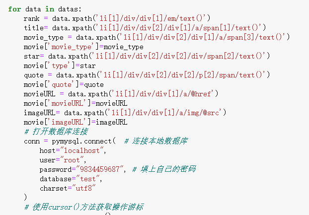
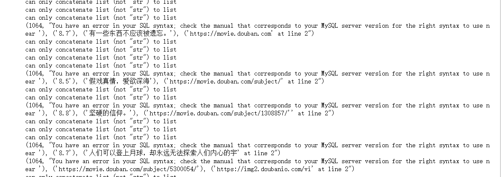
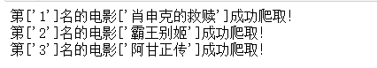
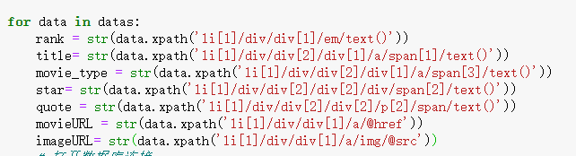
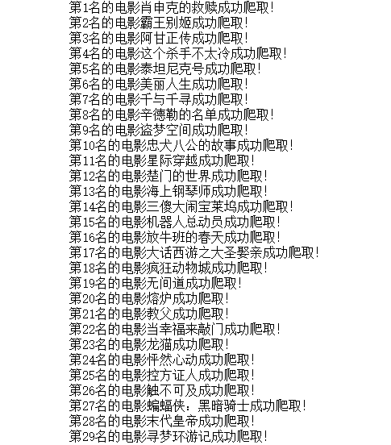

[toc]

# 豆瓣电影Top250爬取

## 爬取目标

1. 电影标题
2. 电影类型
3. 电影标签
4. 电影星级
5. 电影语录
6. 电影URL
7. 封面URL


```
https://movie.douban.com/top250?start=0&filter=
```

分析网页URL 每一页 start 增加25





出现报错？？？

为什么从霸王别姬开始，数据有时候会出错？

我们从网页中寻找答案



哈哈哈，霸王别姬之前不行的，出错的原因每一个返回的都是一个list，我们需要将其装化为字符串才可以，解决！





接下来就要解决为什么我的num是每次加1，而别人的都是每次加25，这是我需要去解决的


