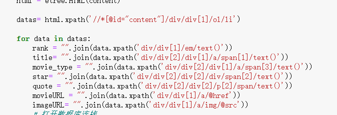
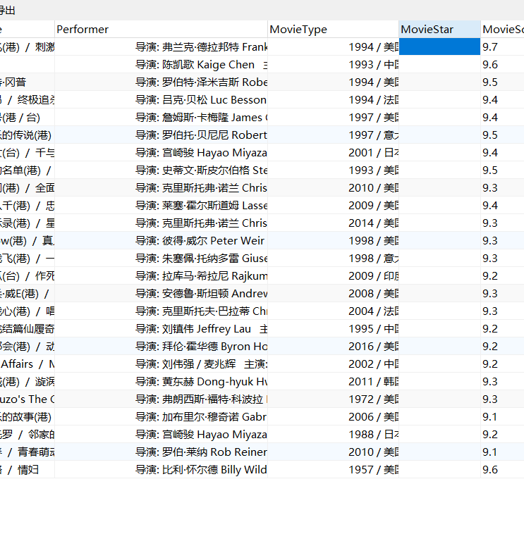
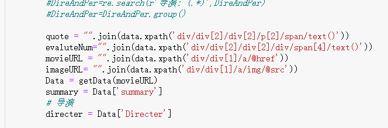
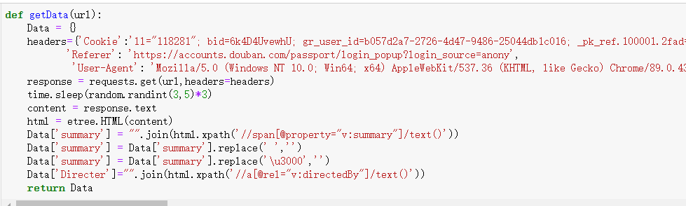
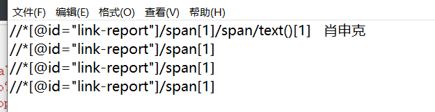
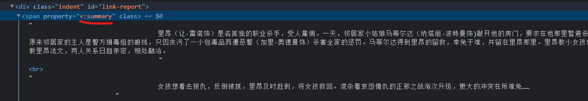
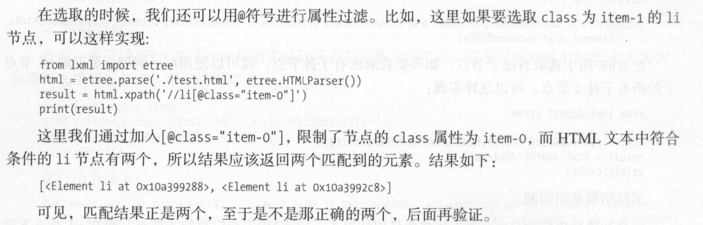

[toc]

# 豆瓣电影Top250爬取

## 爬取目标

1. 电影标题
2. 电影类型
3. 电影标签
4. 电影星级
5. 电影导演
6. 电影语录
7. 电影URL
8. 封面URL
9. 电影简介


```
https://movie.douban.com/top250?start=0&filter=
```

分析网页URL 每一页 start 增加25


出现报错？？？

为什么从霸王别姬开始，数据有时候会出错？

我们从网页中寻找答案


哈哈哈，霸王别姬之前不行的，出错的原因每一个返回的都是一个list，我们需要将其装化为字符串才可以，解决！


接下来就要解决为什么我的num是每次加1，而别人的都是每次加25，这是我需要去解决的




代码的一次改良如下，xpath可以一次性匹配所有的li，在一页中，爬虫速度大大增加，一次爬25页。


最后的话，整个流程跑了一边，我们再创一个表，里面需要获得更多的信息，来进行



发现演员和时间这栏空格很多，而且星级的处理方式和前面的不一样，我们需要另作处理





其实之前一直想办法获取导演，但是到最后，发现其实只要在电影单独的页面，一点进去就有了，定位也很快。第一次我copy成xpath路径虽说快，但是其实是有些时候不适用的，会更麻烦。所以，有必要学习xpath是怎么匹配的。了解了匹配原则后，匹配容易多了。之前我需要构造正则表达式，虽说内容是提取出来了，但是并不是对所有的都是适用的，例如爬到第62的美丽心灵的时候，导演和前面的格式明显不一样，构造失败，虽说可以直接提取导演出来，但是需要用try except，要考虑的就多了很多。又比如，获取简介的时候，获取肖申克的救赎可以，但是后面的都获取不了，因为xpath有些差别所以失败。但是直接用特定的值匹配就快多了。





可见学好xpath是多么重要。