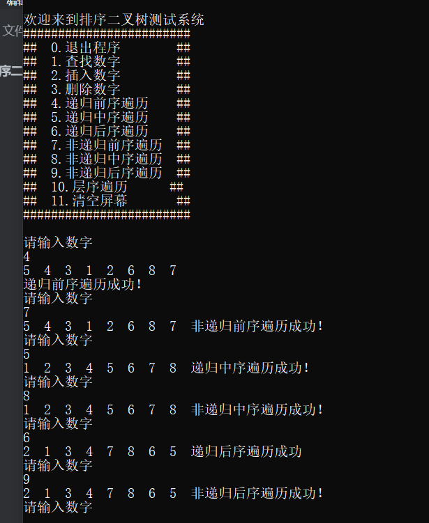

[toc]

# 排序二叉树

#### 二叉树的插入 

定位到合适的位置，二叉树用来统计，如果出现重复的值，则忽略。

#### 二叉树的删除

搜索孩子的值，如果该子树没有孩子，直接删除；如果该子树有孩子，则将该结点的与左孩子的最有结点的值互换，然后删除

对于这种情况，我们考虑的有三种

- 叶子结点
  如果只有叶子结点，直接删除
- 仅有左或右子树的结点 连接左或者右结点
- 左右子树都有的结点

对于我写出的删除 ，考虑到free掉的话，双亲的指针域会指向一个没有初始化的地址，会照成遍历报错，所以，删除时需要考虑双亲的位置

#### 二叉树的遍历

层次遍历：

层次遍历就是将元素逐层进入队列中

前中后序的非递归遍历：

根据递归的写法，还有前序非递归的写法，我们可以推测，中序和后序非递归的实现

中序遍历非递归： 将一个的左孩子，左孩子的左孩子一次入栈，直到没有左孩子，停止入栈。开始出栈，出栈的元素如果没有有孩子，直接出栈。如果有右孩子，该元素出栈后，该元素的右孩子入栈。大概原理如此。后序遍历的非递归实现是通过先将所有的左孩子入栈，然后将所有的右孩子入栈，最后才出栈入队。中序遍历需要注意返回时有没有遍历过左孩子

后序遍历的话比较特别：因为后序遍历相当于前序遍历，从右子树开始遍历，最后再逆序，所以需要两个栈

例如：上图的前序遍历为 5	4	3	1	2	4	8	7   

后序遍历为：2	1	3	6	4	7	8	5 	后序遍历的逆序为 5	8	7	4	6	3	1	2

如果仔细观察，后序遍历的逆序就是前序遍历，不过是先遍历右子树再到左子树