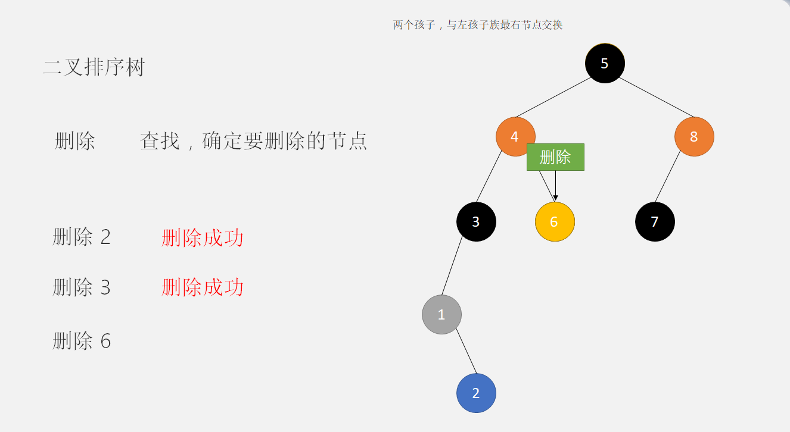

[toc]

# 排序二叉树


#### 二叉树的插入 

定位到合适的位置，二叉树用来统计，如果出现重复的值，则忽略。


#### 二叉树的删除

搜索孩子的值，如果该子树没有孩子，直接删除；如果该子树有孩子，则将该结点的与左孩子的最有结点的值互换，然后删除



对于这种情况，我们考虑的有三种

- 叶子结点
  如果只有叶子结点，直接删除
- 仅有左或右子树的结点 连接左或者右结点
- 左右子树都有的结点

#### 二叉树的遍历


层次遍历：

关于层次遍历我们首先要获取二叉树的高度，这里获取二叉树的高度我采用后序遍历的方法。
当然也可以用递归的方法


前中后序的非递归遍历：

根据递归的写法，还有前序非递归的写法，我们可以推测，中序和后序非递归的实现

中序遍历非递归： 将一个的左孩子，左孩子的左孩子一次入栈，直到没有左孩子，停止入栈。开始出栈，出栈的元素如果没有有孩子，直接出栈。如果有右孩子，该元素出栈后，该元素的右孩子入栈。大概原理如此。后序遍历的非递归实现是通过先将所有的左孩子入栈，然后将所有的右孩子入栈，最后才出栈入队。


```c
        /*数值大，指针左移；数组小，指针右移*/
//        NodePtr p = T->root;
//        NodePtr s;
//        while (p != NULL) {
//            if (data < p->value) {
//                if (p->left == NULL) {
//                    s = (NodePtr) _malloca(sizeof(Node));
//                    s->value = data;
//                    s->left = NULL;
//                    s->right = NULL;
//                    p->left = s;
//                } else
//                    p = p->left; //定位
//            } else if (data > p->value) {
//                if (p->left == NULL) {
//                    s = (NodePtr) _malloca(sizeof(Node));
//                    s->value = data;
//                    s->left = NULL;
//                    s->right = NULL;
//                    p->right = s;
//                }
//            } else/*如果值相同的话，则返回，不需要插入*/
//                return succeed;
//        }
     //定位
     NodePtr p= T->root;
     else
     {
            
     }
```

 插入完成

前中后递归完成

删除完成

递归实现

层次遍历完成